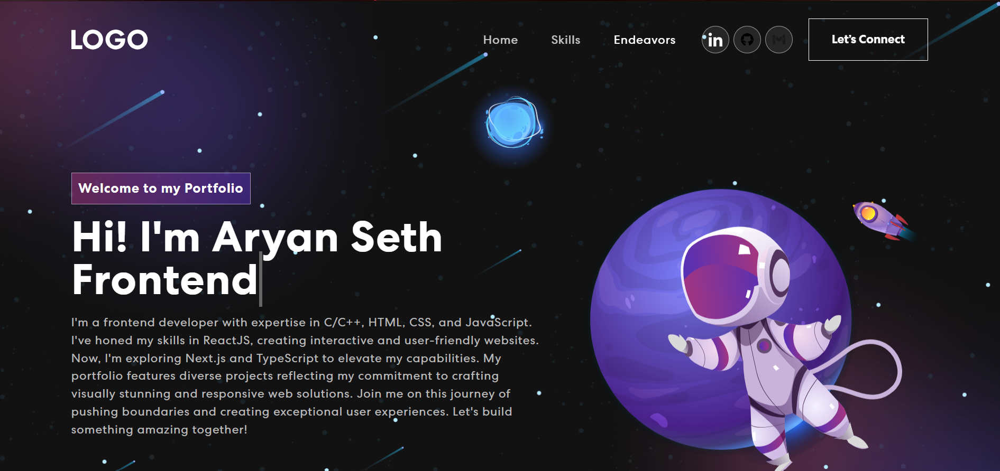

# Personal Portfolio Website

Welcome to my personal portfolio website repository! This website is designed to showcase my qualifications, skills, and projects in a visually appealing and functional manner.

## Features

- **Fully Responsive:** The website is designed to be fully responsive, ensuring an optimal viewing experience on various devices.

## Tech Stack

- **Front-end Library:** React
- **CSS Framework:** React-bootstrap
- **Styling:** CSS
- **Server-side Language:** JavaScript

## Live Demo

Experience the live version of the Portfolio Website at [Live Demo](https://aryan-seth-portfolio3.netlify.app/).

## Motivation

This project serves as a testament to my passion for web development and showcases my ability to combine creativity with technical skills to create a visually captivating and functional portfolio.

## Contributing

Contributions to the Personal Portfolio Website are welcome! If you have any ideas, suggestions, or improvements, please feel free to open an issue or submit a pull request.

The **Personal Portfolio Website** exemplifies my dedication to presenting my skills and experiences in a creative and engaging manner. I hope this project provides a comprehensive and impressive representation of my capabilities as a software developer. Thank you for visiting my portfolio website! If you have any questions or would like to get in touch, please feel free to contact me at [seth.aryan605@gmail.com](mailto:seth.aryan605@gmail.com). Happy coding!
